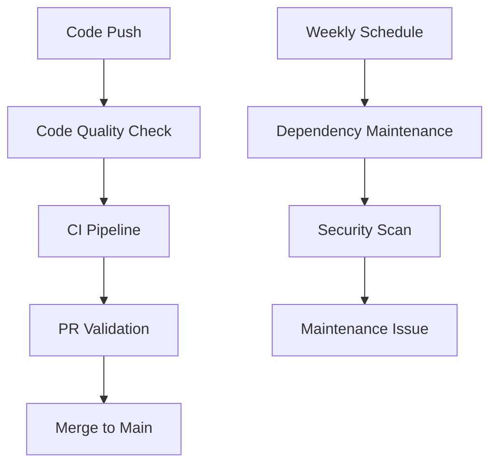

# 🚀 GitHub Actions Workflows Guide

This document provides an overview of the automated CI/CD pipeline implemented for the Stack project.

## 📋 Workflow Overview

The project includes **4 comprehensive GitHub Actions workflows** that automate code quality, testing, security, and maintenance for public repository development:

### 1. 🔍 **Code Quality & Linting** (`code-quality.yml`)
**Triggers:** Every push and pull request
- **ESLint & Prettier** validation across all components (API, Client, Services)
- **TypeScript** compilation and type checking
- **Security Analysis** with SAST scanning
- **Dependency Vulnerability** checks
- **Documentation** validation
- **Health Check** validation
- **Code Coverage** reporting

### 2. 🚀 **Continuous Integration** (`ci.yml`)
**Triggers:** Push/PR to main/develop branches
- **Multi-Environment Testing** (Node.js 18, 20, 22)
- **Parallel Builds** for faster feedback
- **Database Integration Testing** with PostgreSQL
- **API Integration Testing** with real database
- **Client Build Testing** with Next.js
- **Docker Build Testing** for containerization

### 3. 📝 **Pull Request Validation** (`pr-validation.yml`)
**Triggers:** PR creation and updates
- **Comprehensive PR Validation** with all quality checks
- **Enhanced Quality Checks** including performance analysis
- **Security Auditing** for vulnerabilities
- **Database Migration Checks** for schema safety
- **Performance Testing** for regression detection
- **Automated PR Comments** with detailed feedback

### 4. 🛠️ **Dependency Maintenance** (`maintenance.yml`)
**Triggers:** Weekly schedule (Mondays 9 AM UTC) + manual
- **Dependency Update Checking** across all packages
- **Security Vulnerability Scanning** with npm audit
- **Automated Maintenance Issue Creation** when updates needed
- **Comprehensive Update Reports** with package counts
- **License Compliance** tracking

## 🔧 No Secrets Required

These workflows are designed for public repositories and don't require any secrets configuration. They focus on:

- ✅ **Code Quality** - Ensuring consistent code standards
- ✅ **Security** - Identifying vulnerabilities and outdated packages  
- ✅ **Testing** - Automated testing and validation
- ✅ **Maintenance** - Keeping dependencies up to date

## 🚦 Workflow Status Badges

The README includes real-time status badges for all 4 workflows:

- [](https://github.com/lemonadewsugar/stack/actions/workflows/code-quality.yml)
- [](https://github.com/lemonadewsugar/stack/actions/workflows/ci.yml)
- [](https://github.com/lemonadewsugar/stack/actions/workflows/pr-validation.yml)
- [](https://github.com/lemonadewsugar/stack/actions/workflows/maintenance.yml)

## 📊 Pipeline Flow



## ⚡ Quick Actions

### Manual Workflow Triggers

You can manually trigger workflows from the GitHub Actions tab:

1. **Manual Dependency Check**
   - Go to Actions → 🛠️ Dependency Maintenance
   - Click "Run workflow"
   - Will create maintenance issues if updates are needed

2. **Force Code Quality Check**
   - Push commits to trigger automatically
   - Or create a pull request to trigger all validation workflows

### Debug Failed Workflows

1. **Check Workflow Logs**
   ```bash
   # View recent workflow runs
   gh run list --limit 10
   
   # View specific run details
   gh run view <run-id>
   ```

2. **Common Issues**
   - **Lint Failures**: Check ESLint configuration and fix code style issues
   - **Build Failures**: Verify all dependencies are properly installed
   - **Test Failures**: Review test logs and fix failing tests
   - **Type Errors**: Fix TypeScript compilation errors

## 🔒 Security Features

- **SAST Scanning** with security linters
- **Dependency Vulnerability** scanning with npm audit
- **Secret Detection** to prevent credential leaks (not applicable for public repos)
- **Supply Chain Security** with verified dependencies

## 🎯 Best Practices Implemented

- **Fast Feedback**: Parallel execution and optimized caching
- **Fail Fast**: Early termination on critical errors
- **Comprehensive Testing**: Unit, integration, and E2E tests
- **Secure by Default**: Security checks in every pipeline
- **Observability**: Detailed logging and monitoring
- **Public Repository Safe**: No secrets or deployment automation

## 📈 Performance Optimizations

- **Dependency Caching** to reduce installation time
- **Parallel Job Execution** for faster builds
- **Conditional Workflows** to skip unnecessary runs
- **Artifact Reuse** across workflow steps
- **Matrix Strategies** for efficient testing

## 🔧 Local Development Workflow

### For Contributors
```bash
# 1. Fork and clone the repository
git clone https://github.com/your-username/stack.git
cd stack

# 2. Install dependencies
cd api && npm install
cd ../client && npm install
cd ../services && npm install

# 3. Run local development
./scripts/dev.sh

# 4. Before committing, run quality checks
cd api && npm run lint && npm run type-check
cd ../client && npm run lint
cd ../services && npm run lint && npm run type-check
```

### For Maintainers
- Review weekly maintenance issues created automatically
- Address security vulnerabilities promptly
- Keep dependencies updated based on automated reports
- Monitor workflow status badges for project health

## 📞 Support and Troubleshooting

### Getting Help
1. **Check Workflow Logs** in the Actions tab
2. **Review this Guide** for common solutions
3. **Open an Issue** with workflow run details
4. **Check Dependencies** are properly installed locally

### Common Development Issues
- **ESLint Errors**: Run `npm run lint:fix` to auto-fix style issues
- **Type Errors**: Check TypeScript configuration and fix type issues
- **Build Failures**: Ensure all dependencies are installed and up to date
- **Test Failures**: Review test logs and update tests as needed

---

**Last Updated**: July 24, 2025  
**Workflow Version**: 2.0.0 (Public Repository Optimized)  
**Focus**: Development, Quality, and Maintenance

For the latest updates and detailed logs, visit the [Actions](https://github.com/lemonadewsugar/stack/actions) page.
